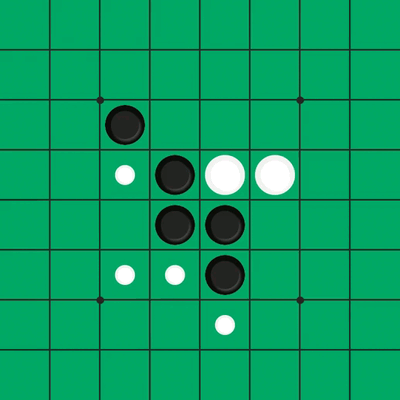
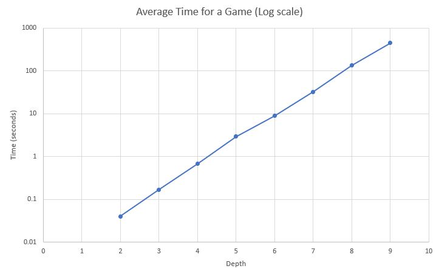

# Othello Engine with AI Agents



The primary objective of this project is to develop an Othello engine that supports different types of AI agents. This allows for the development and comparison of various AI strategies in the game of Othello.

# Table of Contents

- [Othello Engine with AI Agents](#othello-engine-with-ai-agents)
- [Table of Contents](#table-of-contents)
- [The Game](#the-game)
  - [Project Structure](#project-structure)
  - [Requirements](#requirements)
  - [How to launch](#how-to-launch)
    - [Othello GUI](#othello-gui)
    - [Othello Simulation](#othello-simulation)
    - [Tweaking Parameters and Changing Player Types](#tweaking-parameters-and-changing-player-types)
      - [MCTSAgent](#mctsagent)
      - [MinimaxAgent](#minimaxagent)
      - [RandomAgent](#randomagent)
      - [HumanPlayer](#humanplayer)
  - [Numba](#numba)
- [Agents](#agents)
  - [MiniMax](#minimax)
    - [Heuristics](#heuristics)
      - [Heuristics presentation](#heuristics-presentation)
      - [Heuristics Analysis](#heuristics-analysis)
    - [Performance Test](#performance-test)
    - [Improvements Implemented](#improvements-implemented)
      - [1. Negamax Algorithm](#1-negamax-algorithm)
      - [2. Alpha-Beta Pruning](#2-alpha-beta-pruning)
      - [3. Iterative Deepening with Time Constraint](#3-iterative-deepening-with-time-constraint)
      - [4. Transposition Table and Zobrist Hashing](#4-transposition-table-and-zobrist-hashing)
      - [5. Move Ordering](#5-move-ordering)
      - [6. MTD(f) Algorithm](#6-mtdf-algorithm)
      - [7. Bitboards](#7-bitboards)
    - [Potential Improvments](#potential-improvments)
  - [MCTS](#mcts)
    - [Performance Analysis](#performance-analysis)
    - [Conclusions and Recommendations](#conclusions-and-recommendations)
      - [Strengths of MCTS](#strengths-of-mcts)
      - [Weaknesses of MCTS](#weaknesses-of-mcts)
      - [Potential Improvements](#potential-improvements)

---

# The Game

Othello, also known as Reversi, is a strategy board game for two players. The game is played on an `8x8 grid`, and players take turns placing discs on the board. Each player's goal is to have the majority of their color discs on the board at the end of the game. Players can capture the opponent's discs by trapping them between two of their own, flipping the captured discs to their color.

## Project Structure

The project consists of several key components:

- `othello.py`: Contains the core game logic and the `Othello` class.
- `othello_gui.py`: Provides a GUI for playing the game using Pygame.
- `othello_simulation.py`: Enables simulation of multiple Othello games without a GUI for strategy analysis.
- `agents.py`: Contains different types of agents, such as `MCTSAgent`, `MinimaxAgent`, and `HumanPlayer`, which define how players make moves.
- `bitboard_utils.py`: Contains utility functions to handle bitboard operations.
- `heuristics.py`: Contains heuristics functions for handling board evaluation. (Used in MinMax)
- `search_tree.py`: Contains all the logic to perform MCTS.
- `minmax.py`: Contains all the logic to perform Minmax.

## Requirements

You can install the required libraries using the following command:

```bash
pip install pygame numpy numba tqdm
```

## How to launch

### Othello GUI

To play Othello using the graphical user interface (GUI), follow these steps:

1. Select the players and tweak their parameters.
2. Run the following command to launch the Othello GUI:

```bash
python othello_gui.py
```

3. Enjoy playing Othello against different AI agents! (Or watching them playing against each other :))

**Exemple :**

```py
othello_hui.py

if __name__ == "__main__":
    gui = OthelloGui(player1=MinmaxAgent(depth=7, heuristic=HEURISTICS.DISK_PARITY, verbose=True), 
                     player2=MCTSAgent(nb_iterations=250000, nb_rollouts=1,
                                       c_param=1.4, verbose=True))
    
    gui.run_game()
```

### Othello Simulation

To run simulations of Othello games without the graphical user interface (GUI), follow these steps:

1. Select the players and tweak their parameters.
2. Chose the number of simulations and id you want them to be parallelized.
3. Run the following command to launch the Othello simulation:

```bash
python othello_simulation.py
```

4. Monitor the progress of the simulations and view the results!

**Exemple :**

```py
othello_simulation.py

if __name__ == "__main__":
    simulation = OthelloSimulation(player1=MinmaxAgent(depth=7, heuristic=HEURISTICS.STABILITY),
                                   player2=MCTSAgent(nb_iterations=100000))
    
    simulation.run_simulation(num_simulations=50, parallel=True)
```

### Tweaking Parameters and Changing Player Types

You have the ability to customize gameplay by adjusting parameters and selecting different player types. Each player type offers distinct strategies and behaviors. Below are the available player types along with their configurable parameters:

#### MCTSAgent

- `nb_iterations:` The number of iterations for Monte Carlo Tree Search (MCTS).
- `nb_rollouts:` The number of rollouts (simulations) per iteration.
- `time_limit:` The time limit for MCTS in seconds.
- `c_param:` The exploration constant for MCTS.
- `verbose:` If enabled, debug information is printed during search.

#### MinimaxAgent

- `depth:` The depth to which the Minimax algorithm will search.
- `time_limit:` The time limit for the Minimax search in seconds.
- `verbose:` If enabled, debug information is printed during the search process.
- `heuristic:` The type of heuristic function used for evaluation.
  - *HYBRID*
  - *STABILITY*
  - *MOBILITY*
  - *CORNER*
  - *DISK_PARITY*

#### RandomAgent

No configurable parameters. Makes random moves.

#### HumanPlayer

No configurable parameters. Allows human input for moves via mouse clicks.

## Numba

This project utilizes Numba to improve computational performance. `Numba` is a Python library that accelerates code execution by using **Just-In-Time (JIT) compilation**. It **optimizes loops** and **numerical functions** by **compiling them into machine code** for faster execution.

During the first run of the code, Numba compiles annotated functions in real-time. This means that the initial execution might take longer as Numba needs to cache all compiled functions. However, subsequent runs will benefit from this precompiled cache, resulting in improved performance.

**Exemple :**

Let's time this simple function with `timeit` to see the performance differences between pure python and numba.
This king of function is relevant to the project because we're using bitboards and it requires a lot of bitwise operations.

```py
def test():
    x = 12345678901234567890
    for x in range(10000):
        y = x; y >>= 32
```

**Pure Python**:     `100 loops, best of 5: 4.16 µs per loop` or `4160 ns per loop`\
**With numba** : `5000000 loops, best of 5: 44.6 ns per loop`

As we can see, the **compiled version with Numba is significantly faster**. It executes in approximately 44.6 nanoseconds per loop, compared to 4160 nanoseconds per loop for the pure Python function. This represent a **x100 gains** achieved by using Numba, particularly for operations involving intensive bitwise manipulations, which are common in our bitboard-based project.

**EDIT**:

After refactoring the entire codebase to leverage Numba for efficient implementation and optimization of operations on bitboards, significant speed-ups were achieved. For instance, in the case of the MCTS algorithm, we observed a **remarkable improvement** from approximately **15,000 iterations in 2 seconds** with the initial version (without extensive use of Numba and bitboards) to **300,000 iterations in the same time frame**.

The substantial speed-up observed is not solely attributed to Numba but also to the effective implementation of bitboards. Nevertheless, this represents a remarkable performance improvement in computational efficiency.

---

# Agents

In this engine, with implemented a **Monte Carlo Tree Search (MCTS)** agent and a **Minimax** algorithm. Both algorithms aim to find the optimal move for a player, but they operate under different principles and have distinct advantages and disadvantages.
The idea is to provide a comparative analysis of both algorithms.

## MiniMax

The Minimax algorithm is a recursive method used in decision-making and game theory to determine the optimal move for a player, assuming that the opponent also plays optimally. The algorithm **explores all possible moves to a specified depth** and **evaluates the resulting board** states using an evaluation function. The main idea is to **maximize the player's minimum gain**, which leads to the name "Minimax."

### Heuristics

When employing algorithms like Minimax, heuristics help to assess the desirability of different board states, guiding the AI in its gameplay strategy. Heuristics are rules of thumb or strategies used to make quick, efficient decisions that are not guaranteed to be perfect but are practical and sufficient for the task at hand. In the context of Othello, heuristics evaluate the board state to determine which moves are likely to lead to a favorable outcome.

#### Heuristics presentation

1. `Disk Parity Heuristic`: The Disk Parity Heuristic evaluates the **difference in the number of disks between the player and the opponent**. It calculates the percentage difference relative to the total number of disks on the board. It provides a straightforward measure of dominance in terms of disk count.

2. `Mobility Heuristic`: The Mobility Heuristic assesses both **actual** and **potential** mobility for the player and the opponent. This heuristic aims to maximize the player's flexibility and options for future moves while restricting the opponent's options, thus maintaining strategic advantage.
    - **Actual mobility** refers to the number of legal moves available to the player.
    - **Potential mobility** refers to the number of potential moves (empty cells adjacent to the opponent's disks).

3. `Corner Control Heuristic`: The corner control heuristic evaluates the **control of corner squares** (A1, A8, H1, H8). It considers both the number of **corners occupied** and the **potential to occupy corners** (possible moves to corner positions). Controlling corners is highly advantageous in Othello as it provides stable positions that are difficult for the opponent to flip. This heuristic prioritizes securing these key positions.

4. `Stability Heuristic`: The stability heuristic evaluates the number of stable and unstable disks. This heuristic aims to **maximize the number of stable disks** while **minimizing the number of unstable disks**, ensuring a lasting advantage on the board.
    - **Stable disks** are those that cannot be flipped for the rest of the game.
    - **Unstable disks** are those that can be flipped at the next move of the opponent.

5. `Hybrid Heuristic`: The Hybrid Heuristic combines **multiple heuristics**, including Disk Parity, Mobility, Corner Control, and Stability, with **weighted scores**. It aims to overcome the limitations of individual heuristics by integrating multiple factors for a more comprehensive evaluation of the board state. The current weights are the following :
   - **Disk Parity Heuristic**: $`({1 + ({number\_of\_disks \over 64})})^6`$ This scales exponentially as the game progresses.
   - **Mobility Heuristic**: 20
   - **Corner Control Heuristic**: 50
   - **Stability Heuristic**: 40

6. `Static Weights Heuristic`: The Static Weights Heuristic evaluates the board state by performing matrix multiplication between the board state matrix and a **predefined weight matrix**. It sums up the products to obtain the final evaluation score. This heuristic uses a predefined strategy to prioritize certain board positions over others, guiding the player towards favorable positions.

The **first five heuristics** provide a **relative evaluation** between the player and the opponent, with scores ranging **from -100 to 100**. A positive value indicates an advantage for the player, while a negative value suggests an advantage for the opponent.

#### Heuristics Analysis

To test the performances of our heuristics, we decided to make our **MinMaxAgents** play against each others for **50 games** with **different heuristics** and with a **depth of 5**. The results are expressed as follow : `(win/loss/draw) winrate`

| Heuristics     | Disk Parity | Stability | Corner | Mobility | Hybrid |
|----------      |---------------|----------|----------|---------|------|
| Disk parity    | -   |  - | -  |-  | -   |
| Stability      | (**50**/0/0) **100%**  | -   | -  | -    | -   |
| Corner         | (**40**/9/1) **80%**  | (8/**40**/2) **16%**      | -       | -      | -   |
| Mobility       | (6/**44**/0) **12%**  |(0/**50**/0) **0%** | (15/**35**/0) **30%** | -   | -|
| Hybrid         | (**50**/0/0) **100%**  | (**50**/0/0) **100%** | (**48**/2/0) **96%** | (**50**/0/0) **100%**  | -   |

The results revealed interesting insights into each heuristic's performance. The **Stability heuristic stood out as particularly** promising, achieving a perfect win rate against all other heuristics except for the Corner heuristic, against which it still performed well but not flawlessly. This implies that the **Corner heuristic's strategy of quickly securing corner positions can effectively disrupt Stability’s aim to establish stable disks**. Disk Parity, as expected, performed poorly, demonstrating that **having the most disks before the game's end is not necessarily an advantage**. Instead, it provides more mobility to the opponent, allowing them to capture more pieces.

The **Mobility heuristic was the least effective**, as it focuses solely on maximizing the number of legal moves without considering positional strength. **This heuristic likely works better when combined with others**, but on its own, it does not perform well.

Finally, the **Hybrid heuristic outperformed all other heuristics**, showcasing the **effectiveness of combining multiple evaluation criteria**. These results indicate that a multifaceted approach provides a robust and adaptable strategy for Othello gameplay.

### Performance Test

This parts aims to test the performance of the Minmax with the improvements made. We plotted the evolution of the average time per game as the depth increases. The main goal is to see if the improvments that are implemented actually helps reducing the branching factor and thus increasing the depth we can reach. The average branching factor for Othello is about $10$.



Based on the analysis of the graph and some calculations, it's evident that **the branching factor has significantly decreased** to approximately $4$. This deduction comes from observing that the curve follows an order of $4^x$, where $x$ represents the depth. This reduction in the branching factor is a noteworthy improvement compared to the original Othello game, which had a branching factor of 10.

However, despite this improvement, **there is still considerable scope for further enhancement**. One notable avenue for improvement is the adoption of additional pruning techniques like Late Move Reduction (LMR). By implementing LMR, it's conceivable to further reduce the branching factor to around $2.5$. This reduction would align more closely with the branching factors observed in competitive chess engines today.

### Improvements Implemented

#### 1. Negamax Algorithm

Negamax is a streamlined version of the Minimax algorithm, specifically designed for **zero-sum games**. It leverages the property $`\max(a, b) = -\min(-a, -b)`$, which simplifies the recursive evaluation process. Instead of having separate maximization and minimization functions, **Negamax uses a single function where the perspective of the opponent is represented by negating the score**. This means that the maximizing player’s gain is equivalent to the minimizing player’s loss. By always maximizing from the current player's perspective and negating the score when switching turns, Negamax reduces the complexity of the implementation and potential errors associated with handling two different functions.

The Negamax algorithm operates as follows:

```py
function negamax(node, depth, color) is
    if depth = 0 or node is a terminal node then
        return color × the heuristic value of node
    value := −∞
    for each child of node do
        value := max(value, −negamax(child, depth − 1, −color))
    return value
```

#### 2. Alpha-Beta Pruning

Alpha-Beta pruning is a **common prunning technique** that enhances the Negamax algorithm by eliminating branches in the game tree that cannot influence the final decision. It introduces two values, alpha and beta, which represent the minimum score that the maximizing player is assured of and the maximum score that the minimizing player is assured of, respectively. As the algorithm explores the tree, these values are updated and used to prune branches that are not promising. If a branch is found where the score is worse than a previously examined option for the player, further exploration of that branch is stopped. This **significantly reduces the number of nodes evaluated**, enabling deeper searches within the same computational limits.+

#### 3. Iterative Deepening with Time Constraint

Iterative deepening is a search strategy where the **algorithm progressively deepens the search one level at a time** until a time limit is reached. This approach ensures that the best possible move is found within the given time constraint. By starting with a shallow search and gradually increasing the depth, the algorithm can return the best move found so far if the time runs out. This provides an anytime characteristic, meaning that it can be interrupted and still return a valid move. It combines the benefits of depth-first and breadth-first search, allowing the agent to adapt its search depth dynamically based on the available time.

#### 4. Transposition Table and Zobrist Hashing

The transposition table, coupled with Zobrist hashing, **acts as a memory cache**, storing previously evaluated board states to **avoid redundant calculations**. When the algorithm encounters a board state, it computes its Zobrist hash and checks if the state is already in the transposition table. If found, it retrieves the stored evaluation, saving precious computational resources. Zobrist hashing, by assigning unique bitstrings to each piece position and type, ensures collision-resistant hash keys for board states. **This technique realy shines when integrated with iterative deepening, it enhances the efficiency of the search process by avoiding redundant evaluations across varying depths.**

#### 5. Move Ordering

Move Ordering optimizes the search process by **arranging possible moves based on a heuristic before evaluation**. These scores estimate the potential strength of each move, allowing the **algorithm to prioritize more promising options**. By evaluating stronger moves first, Alpha-Beta pruning becomes more effective, **cutting off unpromising branches early in the search**. This focused exploration of the most influential moves enhances the efficiency of the search, leading to faster convergence on the optimal move. In our implementation, if a move is found in the transposition table for a given position, it is tested first. Otherwise, the remaining moves are sorted using the static weight heuristic, ensuring that the most promising moves are considered early in the search process.

#### 6. MTD(f) Algorithm

MTD(f) is an optimization technique used within iterative deepening to refine the search process. It stands for Memory-enhanced Test Driver with a first guess and combines elements of Negamax and Alpha-Beta pruning. The algorithm starts with an initial guess for the value of the board state and **performs a series of narrow alpha-beta searches to converge on the optimal move**. By refining the search boundaries in small increments, MTD(f) quickly hones in on the best move, **reducing the number of full-width searches needed**. This makes the iterative deepening process more efficient, leading to faster convergence on the optimal move.

#### 7. Bitboards

Essentially, a bitboard represents the state of a game board using a series of bits, where each bit corresponds to a specific square or position on the board. These bits are typically arranged in a single binary word, often a 64-bit integer, where each bit represents the occupancy of a square on the game board. They enable **rapid and streamlined manipulation of the game state through bitwise operations**. This efficiency extends to various tasks such as flipping pieces, verifying legal moves, and updating the board, resulting in faster execution times compared to traditional array-based implementations. Moreover, bitboards consume less memory, making them well-suited for resource-constrained environments.

### Potential Improvments

- Use Late Move Reduction (LMR) to make a more aggressive pruning and only evaluate the most promissing moves at full depth.

## MCTS

MCTS uses random sampling of the search space to build a search tree incrementally. It balances exploration (trying new moves) and exploitation (focusing on promising moves) using the Upper Confidence Bound (UCB1) formula. MCTS is particularly effective in large and complex search spaces where exhaustive search is impractical.

### Performance Analysis

We compared every heuristics of Minmax against MCTS to get an overview of how it is performing.
In each simulation, we set the `time limit` for both players at `1 sec`.

In Othello, if both players are configured with identical settings, the second player tends to win most of the games, indicating that `the second player has an advantage over the first player`.

1. In this first batch of tests, `Minmax is playing first` and `MCTS second` :

| Opponent Heuristic     | MCTS Performance (Win/Loss/Draw) | Win Rate |
|------------------------|-----------------------------------|----------|
| Disk Parity            | **42**/8/0                        | **84%**      |
| Stability              | **45**/2/3                        | **90%**      |
| Corner Control         | 12/**32**/6                       | 24%      |
| Mobility               | **40**/10/0                        | **80%**      |
| Hybrid                 | 7/**41**/2                        | 14%      |

2. In this second batch of tests, `MCTS is playing first` and `Minmax second` :

| Opponent Heuristic     | MCTS Performance (Win/Loss/Draw) | Win Rate |
|------------------------|-----------------------------------|----------|
| Disk Parity            | **40**/7/3                        | **80%**      |
| Stability              | **42**/5/3                        | **84%**      |
| Corner Control         | 15/**32**/3                       | 30%      |
| Mobility               | **38**/9/3                        | **76%**      |
| Hybrid                 | 10/**39**/1                        | 20%      |

According to the results, when two agents have different behaviors, the advantage of not starting becomes almost nonexistent.

### Conclusions and Recommendations

#### Strengths of MCTS

- **MCTS is highly effective against simpler heuristics** like Disk Parity and Mobility. Its exploration strategy allows it to **quickly identify optimal moves** in scenarios where the **opponent's evaluation is based primarily on piece count or potential moves**.
- **MCTS also performs exceptionally** well against the **Stability heuristic**. Despite Stability providing a long-term strategic advantage by focusing on securing stable disks, MCTS’s ability to evaluate numerous potential future states helps it counteract this strategy effectively.

#### Weaknesses of MCTS

- MCTS **struggles** significantly **against the Hybrid and Corner Control heuristics**. The Hybrid heuristic, which combines multiple evaluation criteria (e.g., Disk Parity, Mobility, Stability, Corner Control), presents a multi-dimensional challenge that MCTS’s sampling strategy finds difficult to counter comprehensively.
- **Corner Control is particularly challenging for MCTS**. This heuristic focuses on capturing and maintaining control of the corners of the board, which are highly strategic positions in Othello. **MCTS's general strategy often fails to prioritize these positions effectively**, leading to poorer performance.

#### Potential Improvements

- **Incorporate heuristic guidance into MCTS**: Using heuristics to guide the exploration process within MCTS could improve its performance against complex strategies. For instance, prioritizing moves that lead to control of corners or increase disk stability.
- **Combine MCTS with other algorithms**: Hybrid approaches that integrate MCTS with elements of Minimax or other strategic evaluation methods might overcome its weaknesses against multi-faceted heuristics. This could involve using Minimax for deeper strategic planning in combination with MCTS’s strength in evaluating multiple potential states quickly.

Overall, while MCTS demonstrates strong performance against heuristics focused on simpler metrics like disk count and potential mobility, its limitations against strategies that incorporate multiple factors or emphasize positional control highlight the need for further refinement and hybrid approaches to achieve optimal performance in Othello.
